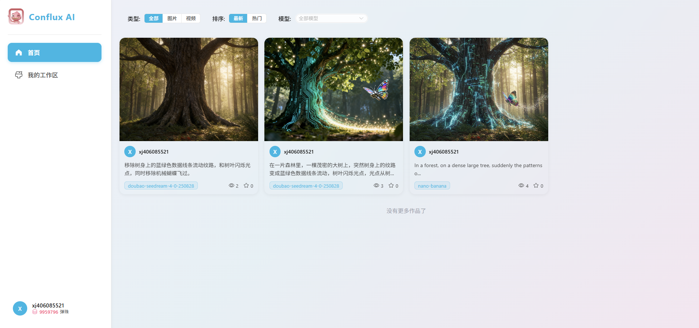
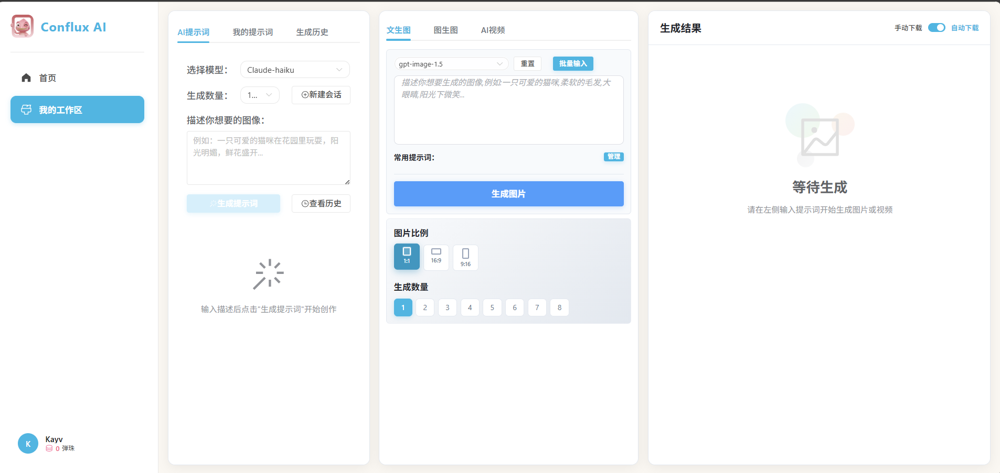
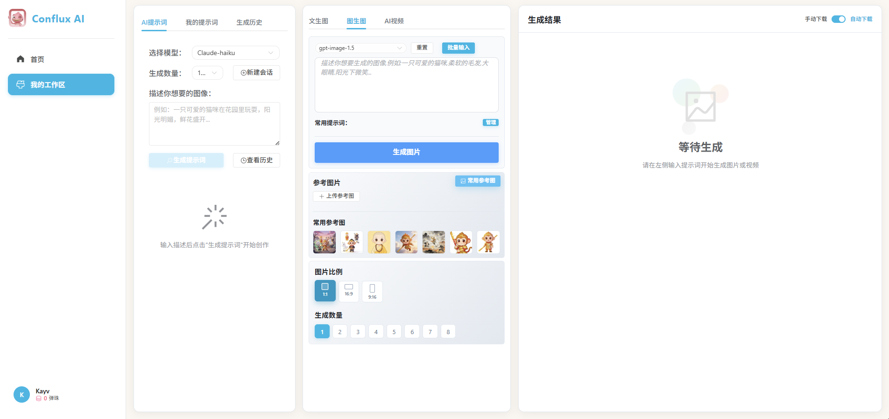
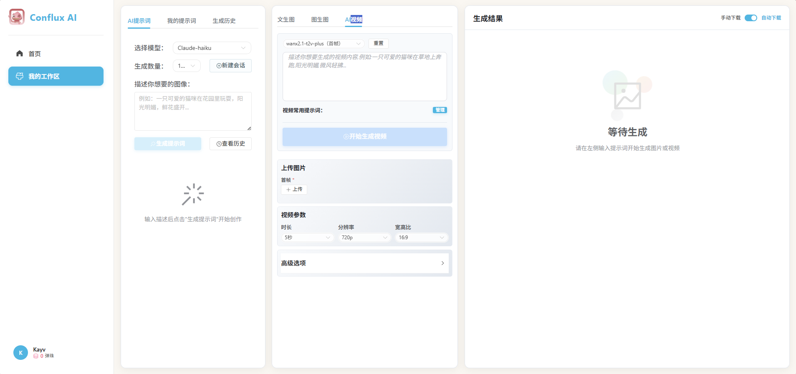

<div align="center">
  
</div>

# 变色龙AI图像生成平台 Chameleon AI Image Generation Platform

[English](#english) | [中文](#chinese)

---

<a name="english"></a>
# English Version

A powerful AI image generation platform supporting text-to-image, image-to-image, video generation, and various AI creative features.

## Project Overview

**"Why did I build this project?"**

This platform started from a simple need – I wanted to make AI content creation more convenient for my own daily use. Every feature here comes from real usage scenarios I encountered:

- I frequently use one reference image to generate different scene variations, and it was tedious to re-upload the same image every time
- When using LLM to generate 10 different prompts, I had to test them one by one by copying and clicking generate repeatedly
- I wanted prompt generation to be integrated into the workflow, not require switching between different tools

So I built this platform to solve these problems, and I'm continuously improving it based on my daily usage experience. This is a practical tool built by a user, for users.

## Key Features

### 💡 Features Built from Real Usage Scenarios

#### 📸 **Saved Reference Images**
Ever wanted to use one image to generate multiple variations but hated re-uploading it every time? I built this feature to save my commonly used reference images. Now I can generate dozens of different scene variations from the same reference without repetitive uploads.

#### 🚀 **Batch Image Generation**
When I use LLM to generate 10 different prompt variations for a scene, testing them one by one was painful. Now I can input all 10 prompts at once, click generate once, and watch them all being created automatically. Massive time saver!

#### ✨ **Integrated Prompt Generation**
Previously I had to generate prompts elsewhere, then copy them back. Now I can generate AI prompts directly within the platform and with one click, send them all to the batch generation menu (supports up to 10 different prompts at once). Seamless workflow!

### Core Features

#### Frontend Capabilities
- **Text-to-Image**: Generate images from text descriptions using AI models
- **Image-to-Image**: Generate new images based on reference images
- **Video Generation**: Support for text-to-video and image-to-video
- **Prompt Management**: Save and manage frequently used prompts
- **Reference Image Management**: Upload and manage reference images
- **Credit System**: User credit management and consumption records
- **History Records**: View all creation history

### Admin System
- **User Management**: User information management and permission control
- **Model Management**: Support for image models, video models, and text models
- **Content Management**: Manage platform content
- **Credit Recharge**: User credit recharge management
- **AI Prompt Generation**: AI-assisted prompt generation and management

## 📸 Project Screenshots

### Homepage
<div align="center">
  
</div>

### Text to Image
<div align="center">
  
</div>

### Image to Image
<div align="center">
  
</div>

### AI Video Generation
<div align="center">
  
</div>

## Tech Stack

### Frontend
- Vue 3
- Element Plus
- Axios
- Pinia (State Management)
- Vue Router

### Backend
- Node.js
- Express.js
- MySQL
- Redis
- JWT (Authentication)
- Alibaba Cloud OSS (Object Storage)

## Project Structure

```
.
├── frontend/              # Frontend application
│   ├── src/
│   │   ├── api/          # API interfaces
│   │   ├── components/   # Components
│   │   ├── views/        # Page views
│   │   └── utils/        # Utility functions
│   ├── package.json
│   └── vite.config.js
├── admin-system/         # Admin system
│   ├── src/
│   │   ├── api/          # API interfaces
│   │   ├── views/        # Admin pages
│   │   └── components/   # Components
│   ├── package.json
│   └── vite.config.js
├── server/              # Backend service
│   ├── routes/          # Routes
│   ├── services/        # Business logic
│   ├── middleware/      # Middleware
│   ├── migrations/      # Database migrations
│   ├── config.js        # Configuration file
│   ├── server.js        # Service entry
│   └── package.json
├── .gitignore
├── LICENSE             # MIT License
└── README.md           # Project documentation
```

## Quick Start

### Requirements
- Node.js 16+
- MySQL 8.0+
- Redis 6.0+
- Alibaba Cloud OSS account

### Installation Steps

1. **Clone the project**
```bash
git clone https://github.com/UnamanoDAO/Conflux.git
cd creatimage-v2
```

2. **Install dependencies**
```bash
# Install frontend dependencies
cd frontend
npm install

# Install admin system dependencies
cd ../admin-system
npm install

# Install backend dependencies
cd ../server
npm install
```

3. **Configure environment variables**

Create a `.env` file in the project root or server directory:

```env
# Database configuration
DB_HOST=localhost
DB_PORT=3306
DB_USER=root
DB_PASSWORD=your_password
DB_NAME=creatimage

# Redis configuration
REDIS_HOST=localhost
REDIS_PORT=6379
REDIS_PASSWORD=

# API configuration
API_BASE_URL=https://api.example.com
API_KEY=your_api_key

# OSS configuration
OSS_REGION=oss-cn-beijing
OSS_ACCESS_KEY_ID=your_access_key
OSS_ACCESS_KEY_SECRET=your_access_secret
OSS_BUCKET=your_bucket
OSS_ENDPOINT=https://oss-cn-beijing.aliyuncs.com

# JWT configuration
JWT_SECRET=your_jwt_secret
JWT_EXPIRES_IN=7d

# Server configuration
PORT=8088
NODE_ENV=development
```

4. **Initialize database**

Create database and import table structure (refer to SQL files in server/migrations directory)

5. **Start services**

```bash
# Start backend service
cd server
npm run dev

# Start frontend service (new terminal)
cd frontend
npm run dev

# Start admin system (new terminal)
cd admin-system
npm run dev
```

6. **Access applications**
- Frontend: http://localhost:5173
- Admin System: http://localhost:3100
- Backend API: http://localhost:8088

## Configuration Guide

### AI Model Configuration
Different AI models can be configured and managed in the admin system:
- Image generation models (e.g., GPT-Image, Flux)
- Video generation models (e.g., Doubao, Google VEO3)
- Text generation models

### Credit System
The platform uses a credit system to control AI model usage:
- Each model is configured with different credit consumption
- Users recharge credits to create content
- Administrators can manually adjust user credits

## API Documentation

### Authentication Endpoints
- `POST /api/auth/register` - User registration
- `POST /api/auth/login` - User login
- `POST /api/auth/admin/login` - Admin login

### Image Generation Endpoints
- `POST /api/generate/image` - Generate image
- `POST /api/generate/image-to-image` - Image to image

### Video Generation Endpoints
- `POST /api/video/text-to-video` - Text to video
- `POST /api/video/image-to-video` - Image to video

### Admin Endpoints
- `GET /api/admin/users` - Get user list
- `GET /api/admin/models` - Get model list
- `POST /api/admin/models` - Add model

## Deployment

### Production Deployment

1. **Build frontend**
```bash
cd frontend
npm run build
```

2. **Build admin system**
```bash
cd admin-system
npm run build
```

3. **Deploy backend**
```bash
cd server
npm start
```

4. **Configure Nginx reverse proxy**

```nginx
server {
    listen 80;
    server_name your-domain.com;

    # Frontend
    location / {
        root /path/to/frontend/dist;
        try_files $uri $uri/ /index.html;
    }

    # Admin system
    location /admin {
        root /path/to/admin-system/dist;
        try_files $uri $uri/ /index.html;
    }

    # Backend API
    location /api {
        proxy_pass http://localhost:8088;
        proxy_set_header Host $host;
        proxy_set_header X-Real-IP $remote_addr;
    }
}
```

## Development Guide

### Adding New AI Models
1. Add new model configuration in "Model Management" of admin system
2. Set model type, API URL, API Key, and other information
3. Configure credit pricing

### Customizing Frontend Components
Frontend components are located in `frontend/src/components/` directory, following Vue 3 Composition API conventions.

### Adding New API Endpoints
1. Create new route file in `server/routes/`
2. Implement business logic in `server/services/`
3. Register route in `server.js`

## Contributing

Contributions are welcome! Please follow these steps:

1. Fork this repository
2. Create feature branch (`git checkout -b feature/AmazingFeature`)
3. Commit changes (`git commit -m 'Add some AmazingFeature'`)
4. Push to branch (`git push origin feature/AmazingFeature`)
5. Submit Pull Request

## License

This project is licensed under the MIT License - see [LICENSE](LICENSE) file for details

## Contact

For questions or suggestions, please open an issue for discussion.

## Changelog

### v1.8 (Latest)
- Added video model management feature
- Optimized user interface
- Fixed several bugs

### v1.7
- Added AI prompt generation feature
- Optimized credit system
- Improved admin interface

## Acknowledgments

Thanks to all developers who contributed to this project.

---

<a name="chinese"></a>
# 中文版

一个功能强大的AI图像生成平台，支持文生图、图生图、视频生成等多种AI创作功能。

## 💭 项目初衷

**"为什么我要做这个项目？"**

其实做这个平台的初衷很简单——为了方便自己日常使用。每个功能都源于我在使用 AI 创作过程中遇到的真实痛点：

- **常用参考图**：我经常会用一张图生成很多不同场景的图或者视频，每次都需要重新添加参考图就很麻烦
- **批量生图**：比如一个场景用 LLM 生成了 10 个不同的提示词，要一个个试，需要把所有提示词都复制进去每次都点一下生成，现在支持全部输入完成后，点一次生成就可以
- **提示词生成**：以前需要将提示词生成后复制过来，现在可以直接在项目里生成提示词后一键填入批量生成菜单里（一次最多生成 10 个不同的提示词）

所以我就做了这个平台来解决这些问题，并且在日常使用中不断改进。这是一个由用户为用户打造的实用工具，后续有时间我会持续更新。

## ✨ 项目特色

### 💡 真实使用场景驱动的功能

#### 📸 **常用参考图**
有没有遇到过这种情况？想用一张图生成很多不同场景的变体，但每次都要重新上传参考图，特别麻烦。所以我做了这个功能，把我常用的参考图都保存起来，以后想用哪张直接选，不用重复上传。一张参考图可以生成几十种不同场景，效率提升明显！

#### 🚀 **批量生图**
这是我用得最多的功能。有时候用 LLM 生成了一个场景的 10 个不同提示词，想一个个试试看效果，原来要复制 10 次，点 10 次生成。现在把所有提示词一次输进去，点一次生成，全都自动开始生成了，省了好多重复操作。

#### ✨ **提示词一键生成**
以前得在其他地方生成提示词，然后再复制回来。现在直接在项目里就能用 AI 生成提示词，生成完还能一键填入批量生成菜单（一次最多生成 10 个不同的提示词），整个流程无缝衔接。

### 核心功能

#### 前端能力
- **文生图**: 使用AI模型根据文本描述生成图像
- **图生图**: 基于参考图像生成新的图像
- **视频生成**: 支持文生视频和图生视频
- **提示词管理**: 保存和管理常用的提示词
- **参考图像管理**: 上传和管理参考图像
- **积分系统**: 用户积分管理和消费记录
- **历史记录**: 查看所有的创作历史

### 后台管理系统
- **用户管理**: 用户信息管理和权限控制
- **模型管理**: 支持图像模型、视频模型、文本模型的管理
- **内容管理**: 管理平台上的内容
- **积分充值**: 用户积分充值管理
- **AI提示词生成**: AI辅助提示词生成和管理

## 📸 项目截图

### 首页
<div align="center">
  
</div>

### 文生图
<div align="center">
  
</div>

### 图生图
<div align="center">
  
</div>

### AI视频生成
<div align="center">
  
</div>

## 技术栈

### 前端
- Vue 3
- Element Plus
- Axios
- Pinia (状态管理)
- Vue Router

### 后端
- Node.js
- Express.js
- MySQL
- Redis
- JWT (认证)
- 阿里云OSS (对象存储)

## 项目结构

```
.
├── frontend/              # 前端应用
│   ├── src/
│   │   ├── api/          # API接口
│   │   ├── components/   # 组件
│   │   ├── views/        # 页面视图
│   │   └── utils/        # 工具函数
│   ├── package.json
│   └── vite.config.js
├── admin-system/         # 后台管理系统
│   ├── src/
│   │   ├── api/          # API接口
│   │   ├── views/        # 管理页面
│   │   └── components/   # 组件
│   ├── package.json
│   └── vite.config.js
├── server/              # 后端服务
│   ├── routes/          # 路由
│   ├── services/        # 业务逻辑
│   ├── middleware/      # 中间件
│   ├── migrations/      # 数据库迁移
│   ├── config.js        # 配置文件
│   ├── server.js        # 服务入口
│   └── package.json
├── .gitignore
├── LICENSE             # MIT协议
└── README.md           # 项目文档
```

## 快速开始

### 环境要求
- Node.js 16+
- MySQL 8.0+
- Redis 6.0+
- 阿里云OSS账号

### 安装步骤

1. **克隆项目**
```bash
git clone https://github.com/UnamanoDAO/Conflux.git
cd creatimage-v2
```

2. **安装依赖**
```bash
# 安装前端依赖
cd frontend
npm install

# 安装后台管理系统依赖
cd ../admin-system
npm install

# 安装后端依赖
cd ../server
npm install
```

3. **配置环境变量**

在项目根目录或server目录创建 `.env` 文件：

```env
# 数据库配置
DB_HOST=localhost
DB_PORT=3306
DB_USER=root
DB_PASSWORD=your_password
DB_NAME=creatimage

# Redis配置
REDIS_HOST=localhost
REDIS_PORT=6379
REDIS_PASSWORD=

# API配置
API_BASE_URL=https://api.example.com
API_KEY=your_api_key

# OSS配置
OSS_REGION=oss-cn-beijing
OSS_ACCESS_KEY_ID=your_access_key
OSS_ACCESS_KEY_SECRET=your_access_secret
OSS_BUCKET=your_bucket
OSS_ENDPOINT=https://oss-cn-beijing.aliyuncs.com

# JWT配置
JWT_SECRET=your_jwt_secret
JWT_EXPIRES_IN=7d

# 服务器配置
PORT=8088
NODE_ENV=development
```

4. **初始化数据库**

创建数据库并导入表结构（请参考server/migrations目录下的SQL文件）

5. **启动服务**

```bash
# 启动后端服务
cd server
npm run dev

# 启动前端服务（新终端）
cd frontend
npm run dev

# 启动后台管理系统（新终端）
cd admin-system
npm run dev
```

6. **访问应用**
- 前端应用: http://localhost:5173
- 后台管理系统: http://localhost:3100
- 后端API: http://localhost:8088

## 配置说明

### AI模型配置
在后台管理系统中可以配置和管理不同的AI模型：
- 图像生成模型（如 GPT-Image, Flux 等）
- 视频生成模型（如 豆包, Google VEO3 等）
- 文本生成模型

### 积分系统
平台使用积分系统来控制AI模型的使用：
- 每个模型配置不同的积分消耗
- 用户充值积分进行创作
- 管理员可以手动调整用户积分

## API文档

### 认证接口
- `POST /api/auth/register` - 用户注册
- `POST /api/auth/login` - 用户登录
- `POST /api/auth/admin/login` - 管理员登录

### 图像生成接口
- `POST /api/generate/image` - 生成图像
- `POST /api/generate/image-to-image` - 图生图

### 视频生成接口
- `POST /api/video/text-to-video` - 文生视频
- `POST /api/video/image-to-video` - 图生视频

### 管理接口
- `GET /api/admin/users` - 获取用户列表
- `GET /api/admin/models` - 获取模型列表
- `POST /api/admin/models` - 添加模型

## 部署

### 生产环境部署

1. **构建前端**
```bash
cd frontend
npm run build
```

2. **构建后台管理系统**
```bash
cd admin-system
npm run build
```

3. **部署后端**
```bash
cd server
npm start
```

4. **配置Nginx反向代理**

```nginx
server {
    listen 80;
    server_name your-domain.com;

    # 前端
    location / {
        root /path/to/frontend/dist;
        try_files $uri $uri/ /index.html;
    }

    # 后台管理系统
    location /admin {
        root /path/to/admin-system/dist;
        try_files $uri $uri/ /index.html;
    }

    # 后端API
    location /api {
        proxy_pass http://localhost:8088;
        proxy_set_header Host $host;
        proxy_set_header X-Real-IP $remote_addr;
    }
}
```

## 开发指南

### 添加新的AI模型
1. 在后台管理系统的"模型管理"中添加新模型配置
2. 设置模型类型、API地址、API Key等信息
3. 配置积分价格

### 自定义前端组件
前端组件位于 `frontend/src/components/` 目录下，遵循Vue 3 Composition API规范。

### 添加新的API接口
1. 在 `server/routes/` 中创建新的路由文件
2. 在 `server/services/` 中实现业务逻辑
3. 在 `server.js` 中注册路由

## 贡献指南

欢迎贡献代码！请遵循以下步骤：

1. Fork本仓库
2. 创建特性分支 (`git checkout -b feature/AmazingFeature`)
3. 提交更改 (`git commit -m 'Add some AmazingFeature'`)
4. 推送到分支 (`git push origin feature/AmazingFeature`)
5. 提交Pull Request

## 许可证

本项目采用 MIT 许可证 - 查看 [LICENSE](LICENSE) 文件了解详情

## 联系方式

如有问题或建议，欢迎提Issue讨论。

## 更新日志

### v1.8 (最新版本)
- 新增视频模型管理功能
- 优化用户界面
- 修复若干bug

### v1.7
- 新增AI提示词生成功能
- 优化积分系统
- 改进后台管理界面

## 致谢

感谢所有为本项目做出贡献的开发者。
